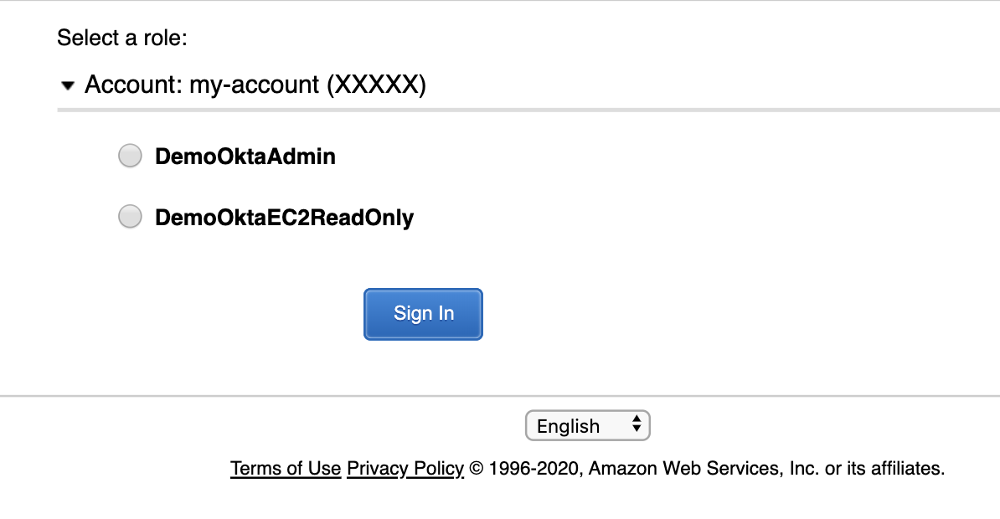

# Okta AWS


This repo contains Terraform modules for setting up/connecting AWS account(s) with an Okta AWS app. A Terraform Module refers to a self-contained packages of Terraform configurations that are managed as a group. 

Okta's integration with Amazon Web Services (AWS) allows end users to authenticate to one or more AWS accounts and gain access to specific roles using single sign-on with SAML. 
For a detailed explanation of Okta SSO setup with AWS, see the [Okta SAML 2.0 AWS Guide](https://saml-doc.okta.com/SAML_Docs/How-to-Configure-SAML-2.0-for-Amazon-Web-Service).

This module can be used to setup an account for both scenarios supported by Okta:
* [*"Connect Okta to a single AWS account"*](https://saml-doc.okta.com/SAML_Docs/How-to-Configure-SAML-2.0-for-Amazon-Web-Service#scenarioA)
* [*"Connect Okta to multiple AWS accounts"*](https://saml-doc.okta.com/SAML_Docs/How-to-Configure-SAML-2.0-for-Amazon-Web-Service#scenarioB)

# Conventions
This Module adheres to [Terraform Module Conventions](https://www.terraform.io/docs/modules/index.html) and has the following folder structure:

* **modules**: This folder contains the reusable code for this Terraform Module, broken down into one or more submodules.
* **examples** : This folder contains examples of how to use the submodules.

# Contributing

* Please create issues for bugs/feature requests.
* Follow the [Terraform Module Conventions](https://www.terraform.io/docs/modules/index.html) when contributing.

# Versioning

This module follows semantic versioning. 

# Usage

When using these modules in your own code, you will need to use a Git URL with a ref attribute that pins you to a specific version of the modules, such as the following example:
  
```hcl-terraform
module "okta_master" {
  source = "github.com/nayyara-samuel/terraform-okta-aws.git/modules/master?ref=0.2.0"  
}

module "okta_child" {
  source = "github.com/nayyara-samuel/terraform-okta-aws.git/modules/child?ref=0.2.0"  
}
```

After completing the setup, AWS roles can be assumed from Okta:

