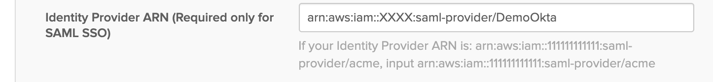

# Okta Single Account Setup

This example setups an AWS account for login via Okta, using both Okta modules [master](../../modules/master) and [child](../../modules/child) in one account. It creates two roles which can be assumed via Okta. 

To run the example:
1) Create an AWS app in Okta.
2) Download the metadata into the file `metadata.xml`
3) Run `make plan` (don't forget to set AWS credentials for Terraform). Sample output:

```bash
$ make plan

Refreshing Terraform state in-memory prior to plan...
The refreshed state will be used to calculate this plan, but will not be
persisted to local or remote state storage.

module.okta_master_setup.data.aws_caller_identity.current: Refreshing state...
module.okta_child_setup.data.aws_iam_policy_document.okta_cross_account_role_assume_policy: Refreshing state...

------------------------------------------------------------------------

An execution plan has been generated and is shown below.
Resource actions are indicated with the following symbols:
  + create

Terraform will perform the following actions:

  # aws_iam_role.sso_role_admin will be created
  + resource "aws_iam_role" "sso_role_admin" {
      + arn                   = (known after apply)
      + assume_role_policy    = (known after apply)
      + create_date           = (known after apply)
      + force_detach_policies = false
      + id                    = (known after apply)
      + max_session_duration  = 3600
      + name                  = "DemoOktaAdmin"
      + path                  = "/"
      + unique_id             = (known after apply)
    }

  # aws_iam_role.sso_role_ec2 will be created
  + resource "aws_iam_role" "sso_role_ec2" {
      + arn                   = (known after apply)
      + assume_role_policy    = (known after apply)
      + create_date           = (known after apply)
      + force_detach_policies = false
      + id                    = (known after apply)
      + max_session_duration  = 3600
      + name                  = "DemoOktaEC2ReadOnly"
      + path                  = "/"
      + unique_id             = (known after apply)
    }

  # aws_iam_role_policy.sso_role_admin_policy will be created
  + resource "aws_iam_role_policy" "sso_role_admin_policy" {
      + id     = (known after apply)
      + name   = "DemoOktaAdminPolicy"
      + policy = jsonencode(
            {
              + Statement = [
                  + {
                      + Effect    = "Allow"
                      + NotAction = [
                          + "organizations:*",
                        ]
                      + Resource  = "*"
                    },
                  + {
                      + Action   = [
                          + "organizations:DescribeOrganization",
                        ]
                      + Effect   = "Allow"
                      + Resource = "*"
                    },
                ]
              + Version   = "2012-10-17"
            }
        )
      + role   = "DemoOktaAdmin"
    }

  # aws_iam_role_policy.sso_role_ec2_policy will be created
  + resource "aws_iam_role_policy" "sso_role_ec2_policy" {
      + id     = (known after apply)
      + name   = "DemoOktaEC2ReadOnlyPolicy"
      + policy = jsonencode(
            {
              + Statement = [
                  + {
                      + Action   = [
                          + "ec2:*",
                        ]
                      + Effect   = "Allow"
                      + Resource = "*"
                    },
                ]
              + Version   = "2012-10-17"
            }
        )
      + role   = "DemoOktaEC2ReadOnly"
    }

  # module.okta_child_setup.aws_iam_saml_provider.okta_saml_provider will be created
  + resource "aws_iam_saml_provider" "okta_saml_provider" {
      + arn                    = (known after apply)
      + id                     = (known after apply)
      + name                   = "DemoOkta"
      + saml_metadata_document = <<~EOT            
            <?xml version="1.0" encoding="UTF-8"?><md:EntityDescriptor entityID="http://www.okta.com/..." 
                        ...
            </md:EntityDescriptor>
        EOT
      + valid_until            = (known after apply)
    }

  # module.okta_master_setup.aws_iam_user.okta_app_user will be created
  + resource "aws_iam_user" "okta_app_user" {
      + arn           = (known after apply)
      + force_destroy = false
      + id            = (known after apply)
      + name          = "okta-app-user"
      + path          = "/"
      + unique_id     = (known after apply)
    }

  # module.okta_master_setup.aws_iam_user_policy.okta_app_user_policy will be created
  + resource "aws_iam_user_policy" "okta_app_user_policy" {
      + id     = (known after apply)
      + name   = "OktaConfigUserPolicy"
      + policy = jsonencode(
            {
              + Statement = [
                  + {
                      + Action   = [
                          + "iam:GetAccountSummary",
                          + "iam:ListRoles",
                          + "iam:ListAccountAliases",
                          + "iam:GetUser",
                          + "sts:AssumeRole",
                        ]
                      + Effect   = "Allow"
                      + Resource = "*"
                    },
                ]
              + Version   = "2012-10-17"
            }
        )
      + user   = "okta-app-user"
    }

Plan: 7 to add, 0 to change, 0 to destroy.
```

4) Run `make apply` -  this runs Terraform apply operation. 
5) Run `make output` which generates the file `output_example.json`. You should see the following section in the outputs:

```json
{
  "okta_user": {
    "sensitive": false,
      "type": "string",
      "value": "arn:aws:iam::XXXXX:user/okta-app-user"
  }
}
```

6) Login to your AWS account and generate an access and secret key for the user created above.
7) Use the credentials to configure the AWS Okta app. See the [Okta App Configuration](https://saml-doc.okta.com/SAML_Docs/How-to-Configure-SAML-2.0-for-Amazon-Web-Service#A-step4) docs.
8) Remember to update the IDP Arn in Okta app:


9) You should also see the following in the outputs section:

```json
{
  "sso_role_arns": {
    "sensitive": false,
    "type": [
      "tuple",
      [
        "string",
        "string"
      ]
    ],
    "value": [
      "arn:aws:iam::XXXXX:role/DemoOktaEC2ReadOnly",
      "arn:aws:iam::XXXXX:role/DemoOktaAdmin"
    ]
  }
}
```
Once you have mapped users to these roles via the Okta, they can assume these two role into AWS!


