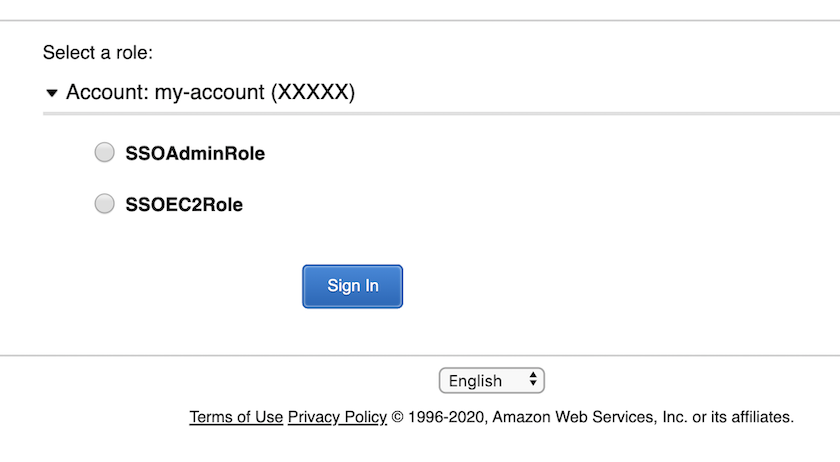

# Okta Single Account Setup

This example setups an AWS account for login via Okta. It creates a single role `SSOTestRole` which can be assumed via Okta. 

To run the example:
1) Create an AWS app in Okta.
2) Download the metadata into the file `metadata.xml`
3) Run `make plan` (do not forget to set AWS creds in environment). Sample output:

```bash
$ make plan

Refreshing Terraform state in-memory prior to plan...
The refreshed state will be used to calculate this plan, but will not be
persisted to local or remote state storage.

data.aws_caller_identity.current: Refreshing state...
data.aws_iam_policy_document.okta_roles_lister_assume_policy: Refreshing state...

------------------------------------------------------------------------

An execution plan has been generated and is shown below.
Resource actions are indicated with the following symbols:
  + create

Terraform will perform the following actions:

  + aws_iam_role.sso_role_admin
      id:                     <computed>
      arn:                    <computed>
      assume_role_policy:     "{\n  \"Version\": \"2012-10-17\",\n  \"Statement\": [\n    ${module.okta_child_setup.okta_assume_role_stanza}\n  ]\n}\n"
      create_date:            <computed>
      force_detach_policies:  "false"
      max_session_duration:   "3600"
      name:                   "Admin"
      path:                   "/"
      unique_id:              <computed>

  + aws_iam_role.sso_role_ec2
      id:                     <computed>
      arn:                    <computed>
      assume_role_policy:     "{\n  \"Version\": \"2012-10-17\",\n  \"Statement\": [\n    ${module.okta_child_setup.okta_assume_role_stanza}\n  ]\n}\n"
      create_date:            <computed>
      force_detach_policies:  "false"
      max_session_duration:   "3600"
      name:                   "EC2ReadOnly"
      path:                   "/"
      unique_id:              <computed>

  + aws_iam_role_policy.sso_role_admin_policy
      id:                     <computed>
      name:                   "AdminPolicy"
      policy:                 "{\n  \"Version\": \"2012-10-17\",\n  \"Statement\": [\n    {\n      \"Effect\": \"Allow\",\n      \"NotAction\": [\n        \"organizations:*\"\n      ],\n      \"Resource\": \"*\"\n    },\n    {\n      \"Effect\": \"Allow\",\n      \"Action\": [\n        \"organizations:DescribeOrganization\"\n      ],\n      \"Resource\": \"*\"\n    }\n  ]\n}\n"
      role:                   "Admin"

  + aws_iam_role_policy.sso_role_ec2_policy
      id:                     <computed>
      name:                   "EC2ReadOnlyPolicy"
      policy:                 "{\n  \"Version\": \"2012-10-17\",\n  \"Statement\": [\n    {\n      \"Effect\": \"Allow\",\n      \"Action\": [\n        \"ec2:*\"\n      ],\n      \"Resource\": \"*\"\n    }\n  ]\n}\n"
      role:                   "EC2ReadOnly"

  + module.okta_child_setup.aws_iam_saml_provider.okta_saml_provider
      id:                     <computed>
      arn:                    <computed>
      name:                   "DemoOkta"
      saml_metadata_document: "<?xml version=\"1.0\" encoding=\"UTF-8\"?>..."
      valid_until:            <computed>

  + module.okta_master_setup.aws_iam_user.okta_app_user
      id:                     <computed>
      arn:                    <computed>
      force_destroy:          "false"
      name:                   "okta-app-user"
      path:                   "/"
      unique_id:              <computed>

  + module.okta_master_setup.aws_iam_user_policy.okta_app_user_policy
      id:                     <computed>
      name:                   "Okta-SSO-User-Policy"
      policy:                 "{\n    \"Version\": \"2012-10-17\",\n    \"Statement\": [\n        {\n          \"Effect\": \"Allow\",\n          \"Action\": [\n              \"iam:ListRoles\",\n              \"iam:ListAccountAliases\",\n              \"iam:GetUser\",\n              \"sts:AssumeRole\"\n          ],\n          \"Resource\": \"*\"\n        }\n    ]\n}\n"
      user:                   "okta-app-user"


Plan: 7 to add, 0 to change, 0 to destroy.

------------------------------------------------------------------------

Note: You didn't specify an "-out" parameter to save this plan, so Terraform
can't guarantee that exactly these actions will be performed if
"terraform apply" is subsequently run.
```

4) Run `make apply` -  this runs Terraform apply operation. 
5) Run `make output` which generates the file `output_example.json`. You should see the following section in the outputs:

```json
{
 "okta_user": {
        "sensitive": false,
        "type": "string",
        "value": "arn:aws:iam::XXXXX:user/okta-app-user"
    }
}
```

6) Login to your account and generate an access and secret key for the user created above.
7) Use the credentials to configure the AWS Okta app. 
8) You should also see the following in the outputs section:

```json
{
    "sso_role_arns": {
        "sensitive": false,
        "type": "list",
        "value": [
            "arn:aws:iam::XXXXX:role/SSOEC2Role",
            "arn:aws:iam::XXXXX:role/SSOAdminRole"
        ]
    }
}
```
You can assume these two role now via Okta login!


