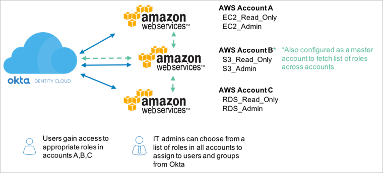

# Okta Child Account Setup

Setups up IAM to have an IDP configured for an Okta AWS app and a standard role required by Terraform to configure the Okta AWS app. 

Creates the following: 
* IAM standard role required by Terraform for configuration, see [setup an IAM role in child account](https://saml-doc.okta.com/SAML_Docs/How-to-Configure-SAML-2.0-for-Amazon-Web-Service#B-step4) in Okta documentation.
* IAM IDP object for authenticating into this account via Okta, see [configure Okta as your IDP](https://saml-doc.okta.com/SAML_Docs/How-to-Configure-SAML-2.0-for-Amazon-Web-Service#A-step1).

For single account setup, set `master-account` to empty array. For multi-account setup, set `master-account` to include master account-id.
 

